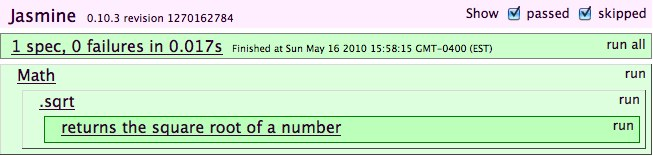
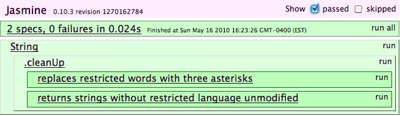
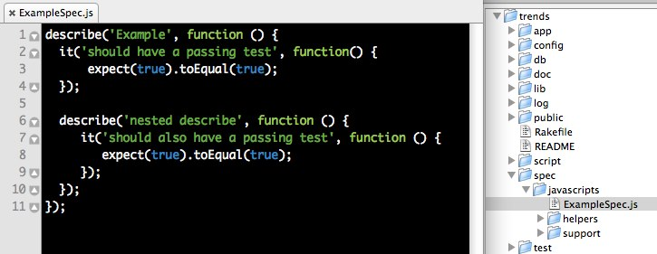
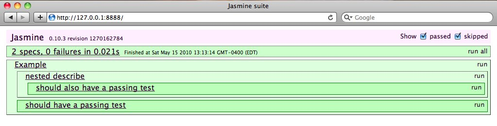

!SLIDE

# TDD with Jasmine

#### @jpignata / BK.js / 2010-05-18

!SLIDE

@@@ js
    describe("Math", function() {
      describe(".sqrt", function() {
        it("returns the square root of a number", function() {
          expect(Math.sqrt(64)).toEqual(8);
        });
      });
    });
@@@
    
!SLIDE
       
 

!SLIDE

# Expectations

!SLIDE

@@@
    As a site administrator
    I want to obfuscate offensive language in comments
    So that I don't risk offending my users
@@@

!SLIDE

@@@ js
    describe("String", function() {
      describe(".cleanUp", function() {
        it("replaces restricted words with three asterisks", function() {
          filterWords = ["golly", "heck"];
          dirtyString = "Golly! What the heck?";
          cleanString = dirtyString.cleanUp(filterWords);
          expect(cleanString).toEqual("***! What the ***?");
        });
      });    
    });
@@@

!SLIDE

 

!SLIDE

@@@ js
    String.prototype.cleanUp = function(filterWords) {
      pattern = filterWords.join("|");
      regExp = new RegExp(pattern, "mig");
      return this.replace(regExp, "***");
    };
@@@

!SLIDE

 

!SLIDE

# Matchers

@@@ js
    expect(cleanString).toEqual("***! What the ***?"); 
    expect(cleanString).toMatch(new RegExp("\\*{3}")); 
    expect(cleanString).toBeDefined(); 
    expect(cleanString).not.toBeNull();
    expect(cleanString).toBeTruthy();
    expect(cleanString).not.toBeFalsy();
    expect(cleanString).not.toContain("golly");
@@@

!SLIDE

# Custom Matchers

@@@ js
    describe("String", function() {
      beforeEach(function() {
        this.addMatchers({
          toBeCleanedUp: function() {
            return this.actual.cleanUp(filterWords) !== this.actual;
          }
        });
      });
    });
@@@

!SLIDE

@@@ js
    describe(".cleanUp", function() {
      beforeEach(function() {
        filterWords = ["justin", "bieber"];  
      });
      
      it("replaces restricted words with three asterisks", function() {
        expect("Justin Bieber: My World").toBeCleanedUp();
      });

      it("returns strings without restricted language unmodified", function() {
        expect("The National: High Violet").not.toBeCleanedUp();
      });
    });    
@@@

!SLIDE

 

!SLIDE

# Spies

!SLIDE

@@@ js
    describe("TwitterTimeline", function() {
      describe(".getPublic", function() {
        it("requests the latest public timeline from Twitter", function() {
          spyOn(jQuery, "getJSON");
          twitterTimeline = new TwitterTimeline();
          apiUrl = "http://api.twitter.com/1/statuses/public_timeline.json?callback=?";
          twitterTimeline.getPublic();
          expect(jQuery.getJSON).wasCalledWith(apiUrl, jasmine.any(Function));
        });
      });
    });
@@@

!SLIDE

@@@ js
    var TwitterTimeline = function() {
      this.publicTimelineUrl = "http://api.twitter.com/1/statuses/public_timeline.json?callback=?"
    };

    TwitterTimeline.prototype = {
      getPublic: function() {
        jQuery.getJSON(this.publicTimelineUrl, function(data, textStatus) {
          // callback
        });
      }
    };
@@@

!SLIDE

# Jasmine Ruby Gem

@@@
    $ rails _2.3.5_ trends
    $ script/generate jasmine
      Jasmine has been installed with example specs.
    $ rake jasmine
      your tests are here: http://localhost:8888/
@@@

!SLIDE

 
 

!SLIDE

# More!

* http://github.com/pivotal/jasmine
* http://github.com/pivotal/jasmine-ruby
* http://groups.google.com/group/jasmine-js

!SLIDE

 

# Happy Hour!

## This Friday @ 7pm

## Blue Owl (2nd Avenue and 12th Street)

#### Follow @pivotallabs