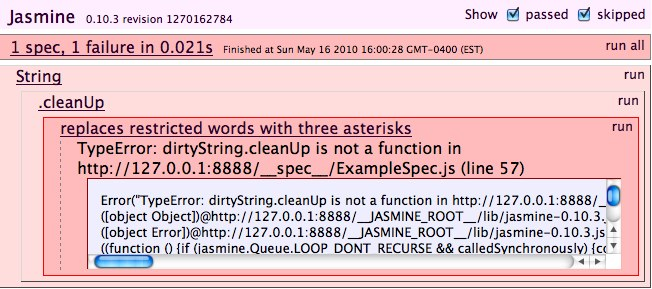
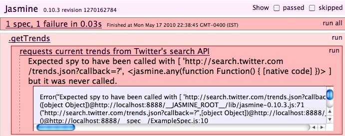
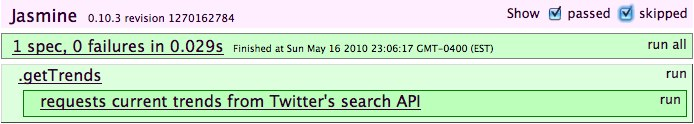
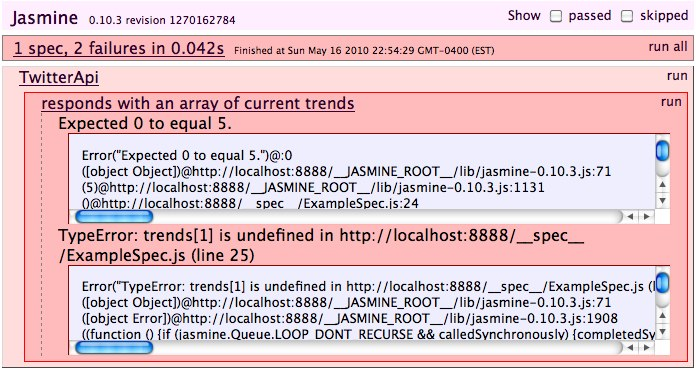
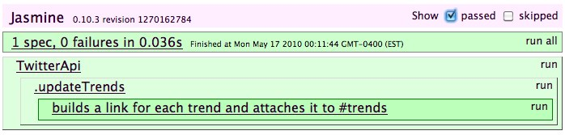
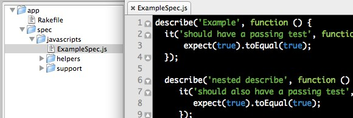

!SLIDE

# TDD with Jasmine

#### @jpignata / BK.js / 2010-05-18

!SLIDE

@@@ js
    describe("Math", function() {
      describe(".sqrt", function() {
        it("returns the square root of a number", function() {
          expect(Math.sqrt(64)).toEqual(8);
        });
      });
    });
@@@
    
!SLIDE
       
 

!SLIDE

# Expectations

!SLIDE

@@@
    As a site administrator
    I want to obfuscate offensive language in comments
    So that I don't risk offending my users
@@@

!SLIDE

@@@ js
    describe("String", function() {
      describe(".cleanUp", function() {
        it("replaces restricted words with three asterisks", function() {
          filterWords = ["golly", "heck"];
          dirtyString = "Golly! What the heck?";
          cleanString = dirtyString.cleanUp(filterWords);
          expect(cleanString).toEqual("***! What the ***?");
        });
      });    
    });
@@@

!SLIDE

 

!SLIDE

@@@ js
    String.prototype.cleanUp = function(filterWords) {
      pattern = filterWords.join("|");
      regExp = new RegExp(pattern, "mig");
      return this.replace(regExp, "***");
    };
@@@

!SLIDE

 

!SLIDE

# Matchers

@@@ js
    expect(cleanString).toEqual("***! What the ***?"); 
    expect(cleanString).toMatch(new RegExp("\\*{3}")); 
    expect(cleanString).toBeDefined(); 
    expect(cleanString).not.toBeNull();
    expect(cleanString).toBeTruthy();
    expect(cleanString).not.toBeFalsy();
    expect(cleanString).not.toContain("golly");
@@@

!SLIDE

# Custom Matchers

@@@ js
    describe("String", function() {
      beforeEach(function() {
        this.addMatchers({
          toBeCleanedUp: function() {
            return this.actual.cleanUp(filterWords) !== this.actual;
          }
        });
      });
    });
@@@

!SLIDE

@@@ js
    describe(".cleanUp", function() {
      beforeEach(function() {
        filterWords = ["justin", "bieber"];  
      });
      
      it("replaces restricted words with three asterisks", function() {
        expect("Justin Bieber: My World").toBeCleanedUp();
      });

      it("returns strings without restricted language unmodified", function() {
        expect("The National: High Violet").not.toBeCleanedUp();
      });
    });    
@@@

!SLIDE

 

!SLIDE

# Spies

!SLIDE

@@@ js
    describe(".getTrends", function() {
      it("requests current trends from Twitter's search API", function() {
        spyOn(jQuery, "getJSON")
        
        twitterApi = new TwitterApi();
        twitterApi.getTrends();
        
        expect(jQuery.getJSON).wasCalledWith(
          "http://search.twitter.com/1/trends/current.json?callback=?", 
          jasmine.any(Function)
        );
      });
    });
@@@

!SLIDE

 

!SLIDE

@@@ js
    var TwitterApi = function() {
      this.trendsUrl = "http://search.twitter.com/1/trends/current.json?callback=?"
    };

    TwitterApi.prototype = {
      getTrends: function() {
        jQuery.getJSON(this.trendsUrl, function(data, textStatus) {});
      }
    };
@@@

!SLIDE

 

!SLIDE

@@@ js
    mockResponse = {
      as_of: "2010-05-18 19:21",
      trends: [
        {name: "Woodford Reserve", url: "http://fake.url/woodford-reserve"},
        {name: "Clojure", url: "http://fake.url/clojure"},
        {name: "iPad", url: "http://fake.url/ipad"},
        {name: "Eyjafjallajokull", url: "http://fake.url/eyjafjallajokull"},
        {name: "Bill Hicks", url: "http://fake.url/bill-hicks"}                
      ]
    };
@@@

!SLIDE

@@@ js
    describe("TwitterApi", function() {
      it("responds with an array of current trends", function() {
        spyOn(jQuery, "getJSON")
        
        twitterApi = new TwitterApi();

        var trends = [];
        twitterApi.getTrends(function(response) { 
          trends = response; 
        });

        jQuery.getJSON.mostRecentCall.args[1](mockResponse);
        expect(trends.length).toEqual(5);
        expect(trends[1]['name']).toEqual('Clojure');
      });
    });
@@@

!SLIDE

 

!SLIDE

@@@ js
    TwitterApi.prototype = {
      getTrends: function(callback) {
        jQuery.getJSON(this.trendsUrl, function(data, textStatus) {
          callback(data["trends"]);
        });
      }
    };
@@@

!SLIDE

 

!SLIDE

# Spy Matchers

@@@ js
    spyOn(jQuery, "getJSON");

    expect(jQuery.getJSON).wasCalled();
    expect(jQuery.getJSON).wasNotCalled();
    expect(jQuery.getJSON).wasCalledWith("http://example.com/service.json");
    expect(jQuery.getJSON).wasNotCalledWith("http://example.com/service.xml");
@@@

!SLIDE

# Spy Definitions

@@@ js
    spyOn(Math, "sqrt").andCallThrough(); // Calls the original function
    spyOn(Math, "sqrt").andReturn(42); // Return 42
    spyOn(Math, "sqrt").andThrow("Exception"); // Throws an exception
    spyOn(Math, "sqrt").andCallFake(function(arg) { 
      return arg * Math.random(); 
    }); // Substitute with fake anonymous function
@@@

!SLIDE 

# Spy Properties

@@@ js
    spyOn(jQuery, "getJSON");
  
    jQuery.getJSON.callCount; // Number of calls to spy
    jQuery.getJSON.mostRecentCall.args; // Arguments for most recent call to the spy
    jQuery.getJSON.argsForCall[1]; // Arguments for a specific call to the spy
@@@

!SLIDE

@@@ js
    describe("TwitterApi", function() {
      beforeEach(function() { 
        jQuery('
').appendTo("body"); 
      });

      afterEach(function() { jQuery("#trends").remove(); });    
  
      describe(".updateTrends", function() {
        it("builds a link for each trend and attaches it to #trends", function() {
          twitterApi = new TwitterApi();
          twitterApi.updateTrends(mockResponse.trends);
          href = jQuery('#trends li a:contains(iPad)').attr('href');
          expect(href).toEqual('http://fake.url/ipad');
        });
      });
    });
@@@

!SLIDE

@@@ js
    TwitterApi.prototype = {
      updateTrends: function(trends) {
        jQuery.each(trends, function(i, trend) {
          li = jQuery("<li />");

          jQuery("<a />")
            .attr("href", trend.url)
            .attr("target", "_blank")
            .html(trend.name)
            .appendTo(li);

          li.appendTo("#trends");
        });
      }
    }
@@@

!SLIDE

 

!SLIDE

# Jasmine Ruby Gem

@@@
    $ gem install jasmine-ruby
    $ rails _2.3.5_ app
    $ cd app
    $ script/generate jasmine
      Jasmine has been installed with example specs.
    $ rake jasmine
      your tests are here: http://localhost:8888/
@@@

!SLIDE

 
 

!SLIDE

# ... or without Rails

@@@
    $ mkdir app
    $ jasmine init
@@@

 

!SLIDE

# Jasmine Ruby Gem

@@@
    $ rake jasmine:ci
@@@

* Built-in Continuous Integration rake task
* Uses Selenium to drive the browser and rspec to test expectations
* Works out of the box with CruiseControl.rb, Hudson, Team City, etc.

!SLIDE

## Fork it on GitHub

* http://github.com/pivotal/jasmine
* http://github.com/pivotal/jasmine-ruby

## Support

* http://groups.google.com/group/jasmine-js

!SLIDE

 

# Happy Hour!

## This Friday @ 7pm

## Blue Owl (2nd Avenue and 12th Street)

#### Follow @pivotallabs